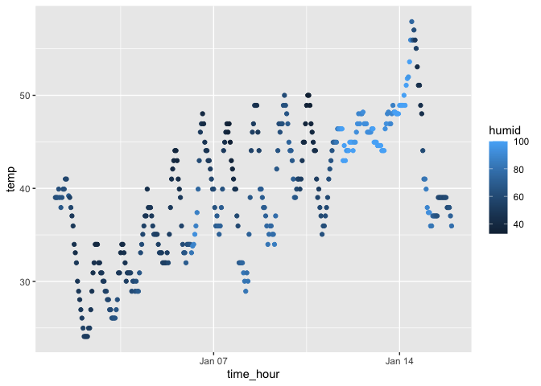

p8105_hw1_yd2739
================
Yuxuan Du
2023-09-14

``` r
library(tidyverse)
```

    ## ── Attaching core tidyverse packages ──────────────────────── tidyverse 2.0.0 ──
    ## ✔ dplyr     1.1.3     ✔ readr     2.1.4
    ## ✔ forcats   1.0.0     ✔ stringr   1.5.0
    ## ✔ ggplot2   3.4.3     ✔ tibble    3.2.1
    ## ✔ lubridate 1.9.2     ✔ tidyr     1.3.0
    ## ✔ purrr     1.0.2     
    ## ── Conflicts ────────────────────────────────────────── tidyverse_conflicts() ──
    ## ✖ dplyr::filter() masks stats::filter()
    ## ✖ dplyr::lag()    masks stats::lag()
    ## ℹ Use the conflicted package (<http://conflicted.r-lib.org/>) to force all conflicts to become errors

## Problem 1

``` r
library("moderndive")

data("early_january_weather")

variables = colnames(early_january_weather)

observation_num = nrow(early_january_weather)

variable_num = ncol(early_january_weather)

mean_temp = mean(pull(early_january_weather, temp))

q1_scatter = ggplot(data = early_january_weather, 
       mapping = aes(x = time_hour, y = temp, color = humid)) + 
  geom_point()

ggsave(
  'problem_1_scatter.png',
  plot = q1_scatter,
  device = png
)
```

    ## Saving 7 x 5 in image

``` r
q1_scatter
```

<!-- --> the
variables in the dataset are: origin, year, month, day, hour, temp,
dewp, humid, wind_dir, wind_speed, wind_gust, precip, pressure, visib,
time_hour.

the size of the data is 358 x 15.

the mean temperature is 39.5821229 degree.

## Problem 2

#### Creating tibble

``` r
Q2_df = tibble(
  samp_10_norm = rnorm(10),
  samp_10_norm_logic = samp_10_norm > 0,
  samp_char_vec = c('A', 'B', 'D', 'E', 'F', 'G', 'H', 'I', 'J', 'K'),
  samp_fac_vec = factor(c('red', 'red', 'red', 'red', 'red', 'red', 'blue', 'blue', 'yellow', 'yellow'))
)
Q2_df
```

    ## # A tibble: 10 × 4
    ##    samp_10_norm samp_10_norm_logic samp_char_vec samp_fac_vec
    ##           <dbl> <lgl>              <chr>         <fct>       
    ##  1       -0.722 FALSE              A             red         
    ##  2        0.581 TRUE               B             red         
    ##  3        0.184 TRUE               D             red         
    ##  4       -1.62  FALSE              E             red         
    ##  5       -0.394 FALSE              F             red         
    ##  6        0.583 TRUE               G             red         
    ##  7       -0.373 FALSE              H             blue        
    ##  8        1.83  TRUE               I             blue        
    ##  9       -0.476 FALSE              J             yellow      
    ## 10        0.857 TRUE               K             yellow

#### Calculating means

``` r
mean(pull(Q2_df, samp_10_norm))
```

    ## [1] 0.04447288

``` r
mean(pull(Q2_df, samp_10_norm_logic))
```

    ## [1] 0.5

``` r
mean(pull(Q2_df, samp_char_vec))
```

    ## Warning in mean.default(pull(Q2_df, samp_char_vec)): argument is not numeric or
    ## logical: returning NA

    ## [1] NA

``` r
mean(pull(Q2_df, samp_fac_vec))
```

    ## Warning in mean.default(pull(Q2_df, samp_fac_vec)): argument is not numeric or
    ## logical: returning NA

    ## [1] NA

among the four vector, char vector and factor vector cannot take mean

#### Transform to numeric form

``` r
as.numeric(pull(Q2_df, samp_10_norm_logic))
as.numeric(pull(Q2_df, samp_char_vec))
as.numeric(pull(Q2_df, samp_fac_vec))
```

We could calculate the mean and transform to numeric for logic vector.
This is reasonable since if logic can be transformed to numbers, we can
calculate the mean.

For char vector, it says NAs introduced by coercion when executing, and
it cannot be transformed to numeric vector. It is reasonable that we
cannot calculate the mean of char vector since we cannot change it to
numeric form.

But for factor vector, the transformation to numeric form seems
succeeded, but we still cannot calculate the mean. The transformation
does not explain why we cannot calculate the mean of the factor vector.
